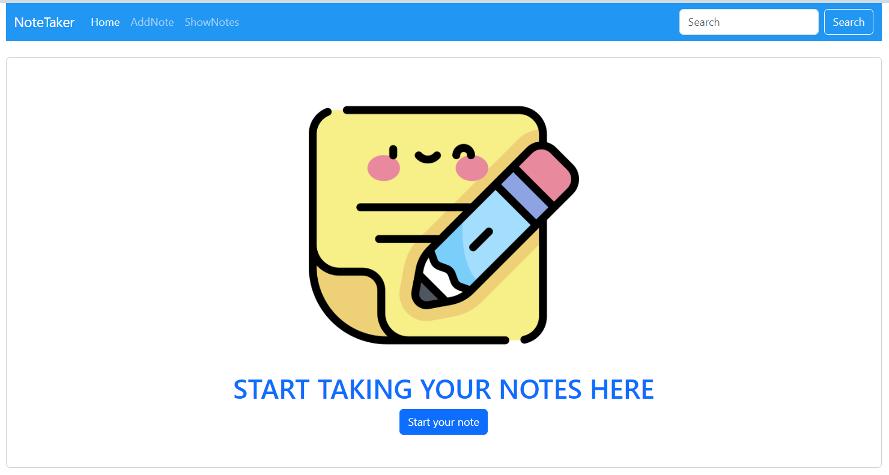
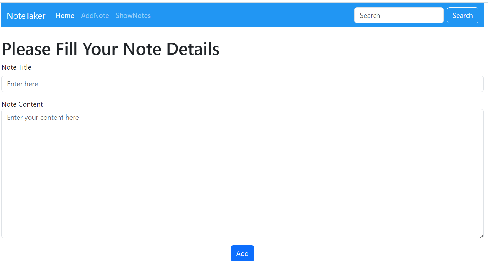
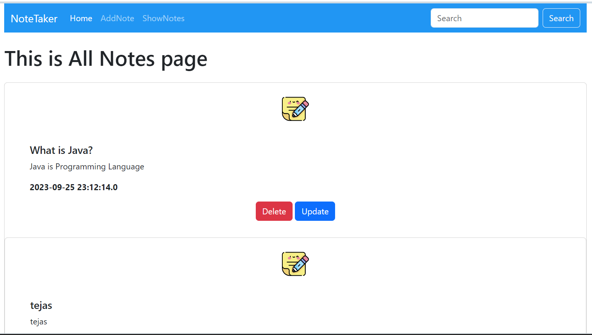

# NoteTaker-App
Overview
The NoteTaker App is a web-based application developed using Java technologies, including JSP (JavaServer Pages), Servlets, and Hibernate. It provides users with the ability to perform CRUD (Create, Read, Update, Delete) operations on notes, allowing them to save both the title and content of their notes. The app is designed to be user-friendly and efficient in managing personal notes.

Technologies used:
1. Java
2. JSP
3. Servlet
4. Hibernate 

Tools used:
1. Eclipse
2. MySql WorkBench

	<code></code>
	<code></code>
	<code></code>
	<code></code>

 
<b>Home Page:</b>
 

     

<b>Add Note:</b>
 

     

<b>Show Notes:</b>
 

     

